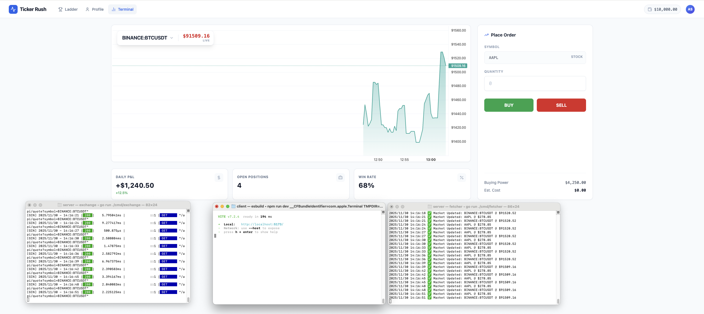

# Ticker Rush



[](https://github.com/tmythicator/ticker-rush/actions/workflows/backend-test.yml)
[](https://github.com/tmythicator/ticker-rush/actions/workflows/frontend-test.yml)
[](https://nixos.org)

## Overview

Ticker Rush is a high-performance, real-time stock trading simulator. The project's core mission is to make the experience of trading stocks enjoyable and risk-free. It provides a platform where users can have fun while learning market dynamics without financial exposure.

Participants start with equal virtual budgets and trade stocks and ETFs. The primary objective is to maximize portfolio value and compete for the top of the leaderboard. A key upcoming feature is the ability for users to compete directly against autonomous AI-trading agents, testing their skills against machine-driven strategies.

## Architecture

Ticker Rush uses a microservices architecture:

- **Backend**: Go (Exchange API + Data Fetcher) using Server-Sent Events (SSE) for real-time updates.
- **Frontend**: React 19 + TypeScript + Tailwind CSS with a focus on performance.
- **Data**: PostgreSQL for persistence and Valkey (Redis fork) for market data caching.

## Roadmap

- [x] **Phase 1: Core Data Pipeline** - Live market data streaming and in-memory caching.
- [/] **Phase 2: Competitive Ladder** - Implementation of a seasonal ladder-like system with top-scorers and performance tracking.
- [ ] **Phase 3: AI-Division** - A dedicated high-frequency ladder specifically for AI-trading bots and automated strategies.

## Quick Start

The fastest way to run the stack is using [Nix](https://nixos.org):

```bash
nix develop
task dev
```

For detailed configuration, manual installation, and testing guidelines, refer to [CONTRIBUTING.md](./CONTRIBUTING.md).

## License

GNU Affero General Public License v3.0 (AGPL-3.0) — see [LICENSE](./LICENSE).

AGPLv3 ensures that Ticker Rush remains open-source. If you run a modified version as a network service, you must share the corresponding source code with your users.
